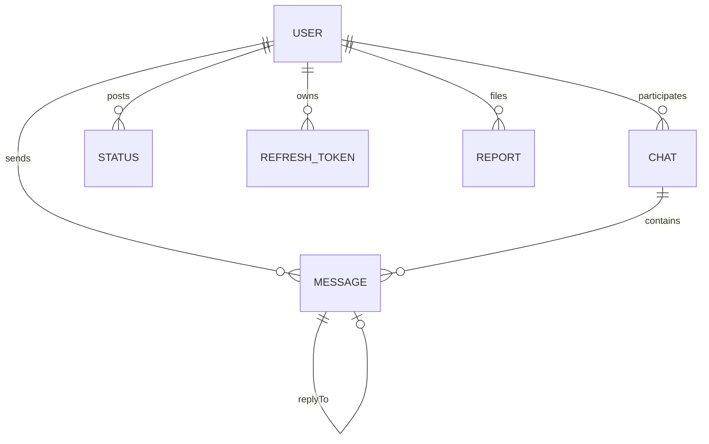

# Production-Grade WhatsApp Web Real-Time Messaging Application

A full-stack, enterprise-grade real-time messaging platform inspired by WhatsApp Web, built using the MERN Stack (MongoDB, Express.js, React, Node.js), Socket.IO, Redis Pub/Sub, WebRTC, and Tailwind CSS.

---

## 🚀 Key Features & Capabilities

- **Real-Time Communication**: Instant messaging, double-tick read receipts (delivered & read), online/offline presence indicators, typing indicators via Socket.IO.
- **Group Chats & Admin Controls**: Create groups, add/remove members, promote multiple admins, group descriptions, custom avatars.
- **Media & File Sharing**: Images, videos, documents (PDF, DOCX, ZIP), audio files with progress preview and max size limits.
- **Voice & Video Calls**: WebRTC end-to-end signaling for 1-on-1 audio and video calls.
- **24-Hour Status / Stories**: Expiring media status updates with view tracking and MongoDB TTL indexing.
- **Admin Control Panel**: Real-time system metrics (total users, active sockets, message volume), user banning/unbanning, and report management.
- **Security & Hardening**: JWT Authentication (Access + Refresh tokens), bcrypt password hashing, Helmet headers, CORS, Express Rate Limiting, input validation.
- **Scalability**: Redis Pub/Sub adapter for horizontal Socket.IO scaling across multiple server instances, compound MongoDB indexing.

---

## 🛠️ Technology Stack

| Layer | Technologies |
| :--- | :--- |
| **Frontend** | React 18, Vite, Tailwind CSS, Lucide Icons, Zustand State Management, Socket.IO Client, Axios |
| **Backend** | Node.js, Express.js, Socket.IO Gateway, Mongoose (MongoDB ORM), Winston Logger |
| **Caching & Scaling** | Redis (ioredis / Socket.IO Redis Adapter) |
| **Authentication** | JWT (JSON Web Tokens), bcryptjs |
| **Storage & Uploads** | Multer disk storage (with Cloudinary / S3 fallback) |
| **DevOps & Containers**| Docker, Docker Compose, Nginx Reverse Proxy, PM2 Process Manager |

---

## 🗄️ Database Schemas & ER Architecture

### Entity-Relationship Diagram



### Models Summary
- **User**: Name, Email, Password (hashed), Avatar, About, `isOnline`, `lastSeen`, `blockedUsers`, `role` (`user`|`admin`), `isBanned`, Privacy settings.
- **Chat**: `isGroupChat`, `name`, `description`, `users` (refs), `groupAdmin` (refs), `latestMessage` (ref), `inviteCode`.
- **Message**: `sender`, `chat`, `content`, `media` (`url`, `type`, `name`, `size`), `readBy`, `deliveredTo`, `replyTo`, `reactions`, `isEdited`, `deletedFor`, `isDeletedForEveryone`.
- **Status**: `user`, `mediaUrl`, `mediaType`, `caption`, `viewers`, `expiresAt` (24h TTL index).

---

## ⚡ Socket.IO Real-Time Events API

| Event Name | Direction | Payload | Description |
| :--- | :--- | :--- | :--- |
| `setup` | Client ➔ Server | `{ _id }` | Joins user's personal notification room |
| `join:chat` | Client ➔ Server | `chatId` | Joins active chat room |
| `typing:start` | Client ➔ Server | `{ chatId }` | Broadcasts typing status to room |
| `typing:stop` | Client ➔ Server | `{ chatId }` | Clears typing indicator |
| `message:send` | Client ➔ Server | `MessageObject` | Delivers new message real-time |
| `message:read` | Client ➔ Server | `{ messageId, chatId }` | Updates read receipt (blue double tick) |
| `call:initiate` | Client ➔ Server | `{ toUserId, offer, callType }` | Initiates WebRTC call signaling |
| `presence:update`| Server ➔ Client | `{ userId, isOnline }` | Broadcasts user online/offline status |

---

## 🔌 REST API Endpoints

### Authentication (`/api/auth`)
- `POST /api/auth/register` - Create user account
- `POST /api/auth/login` - Authenticate user & receive tokens
- `POST /api/auth/refresh` - Exchange refresh token for new access token
- `POST /api/auth/logout` - Revoke session

### User Management (`/api/users`)
- `GET /api/users?search=query` - Search users by name/email
- `GET /api/users/profile` - Fetch logged-in user profile
- `PUT /api/users/profile` - Update profile info & privacy
- `POST /api/users/avatar` - Upload profile picture
- `POST /api/users/block` - Toggle block user
- `PUT /api/users/change-password` - Update password

### Chats & Groups (`/api/chats`)
- `GET /api/chats` - Fetch all user chats
- `POST /api/chats` - Access or create 1-on-1 chat
- `POST /api/chats/group` - Create new group chat
- `PUT /api/chats/group/add` - Add member to group
- `PUT /api/chats/group/remove` - Remove member or leave group

### Messages (`/api/messages`)
- `GET /api/messages/:chatId` - Paginated messages for a chat
- `POST /api/messages` - Send message (with optional file attachment)
- `PUT /api/messages/:messageId` - Edit message content
- `DELETE /api/messages/:messageId` - Soft delete for me or everyone
- `POST /api/messages/:messageId/react` - Add/toggle emoji reaction

### Admin Panel (`/api/admin`)
- `GET /api/admin/stats` - Fetch system analytics & metrics
- `GET /api/admin/users` - Fetch user list for administration
- `POST /api/admin/ban/:userId` - Toggle user ban state

---

## ⚙️ Quick Start & Installation

### 1. Prerequisites
- Node.js (v18+) & npm
- MongoDB (Local or MongoDB Memory Server fallback enabled)

### 2. Backend Setup
```bash
cd backend
npm install
npm run seed     # Populates demo users (Admin, Alice, Bob, Charlie)
npm run dev      # Starts Express & Socket.IO server on port 5000
```

### 3. Frontend Setup
```bash
cd frontend
npm install
npm run dev      # Starts Vite React application on http://localhost:3000
```

### 🔑 Demo Login Credentials
- **Admin**: `admin@whatsapp.com` / `password123`
- **Alice**: `alice@whatsapp.com` / `password123`
- **Bob**: `bob@whatsapp.com` / `password123`
- **Charlie**: `charlie@whatsapp.com` / `password123`

---

## 🐳 Docker Deployment

To build and launch all containers (Node App, MongoDB, Redis, Nginx Reverse Proxy):

```bash
cd backend
docker-compose up --build -d
```
# Nexus-Chat
